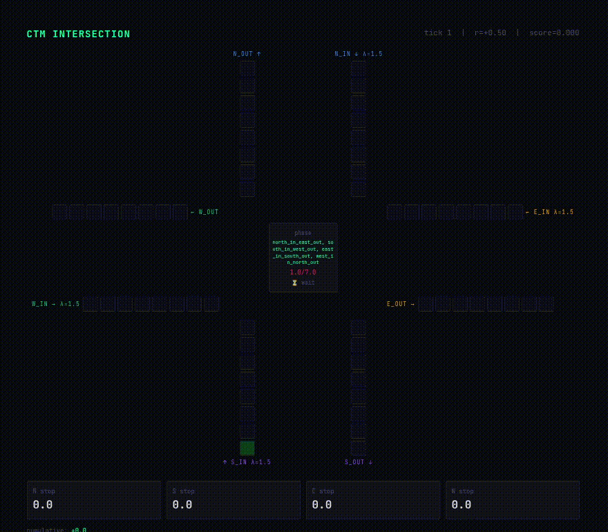
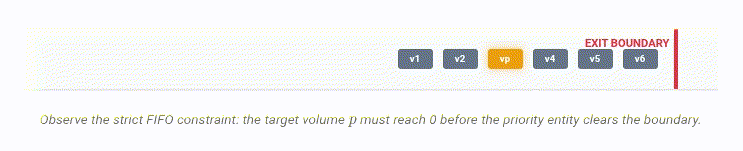

<div align="center">
  
# 🚦 Traffic Env: Devolving Microscopic Priority to Mesoscopic Cells
**An OpenEnv Environment with Spatiotemporal Traffic Flow Emulation**


[](https://etherealwhisper-traffic-env-ui.hf.space)
[](https://kushalsuvan.github.io/vhue)
[](https://colab.research.google.com/drive/1TMq_qdFoHaiauP6KtKoWYse9n33RYw3x?usp=sharing)

> ## **🚨 NOTE FOR JUDGES: Please use the badges above for direct links to our Live Interactive UI, the Mathematical Proofs blog, and the Colab Training Script! 🚨**


*You live in Bangalore with its traffic. You know the problem...*

<br><br>


<br>
<br>
<p><i>The Traffic Env OpenEnv UI, demonstrating stochastic phase shifts and real-time route execution.</i></p>
<br>

</div>

---

> ## **🚨 NOTE FOR JUDGES: Please use the badges above for direct links to our Live Interactive UI, the Mathematical Proofs blog, and the Colab Training Script! 🚨**

---

## 1. The Problem: A Universal Testbed for Spatial-Temporal Flow
Traffic management is one of the most complex stochastic challenges in the real world. A standard intersection does not just require an agent to "prevent crashes"; it requires forecasting dynamically shifting Origin-Destination (OD) probability matrices and handling cascading fluid dynamics.

Traditionally, modeling this requires tracking 10,000+ individual vehicle entities (Microscopic/Lagrangian tracking), which is computationally explosive, slow, and incredibly difficult to interface with modern AI training loops. 

**Our Novel Angle:** We didn't just build a game; we built an agent-agnostic research sandbox. By leveraging modern Traffic Flow Theory, we established a rigorous mathematical proof that under a strict "no-overtake" (FIFO) constraint, the complex problem of **microscopic priority routing** mathematically devolves into a highly efficient **mesoscopic cell eviction** problem. 

This environment provides researchers with a mathematically accurate, lightweight spatial-temporal benchmark. Whether you are testing an LLM, a traditional RL agent, or a heuristic algorithm, this OpenEnv environment exposes the raw, underlying physics of traffic flow.

---

## 2. Environment Architecture & Physics
Because this environment is agent-agnostic, the underlying simulation must be flawless. This is a rigorously backed physics environment built on the **Lighthill-Whitham-Richards (LWR)** conservation law and computationally discretized using **Daganzo’s Cell Transmission Model (1994)**.

<div align="center">
  
  <p><i>Figure 1: The mathematical "no-overtake" constraint forcing the intersection to process priority vehicle routing as a bulk cell-eviction task.</i></p>
</div>

### The Observation Space
The environment exposes a heavily optimized, real-world mesoscopic state to whatever client connects to it:
* **Cell Occupancy Densities:** Flow volumes waiting at intersection boundaries, representing kinetic fluid density waves.
* **Global Route Probability Distributions:** An encoded matrix representing the current temporal "phase" of traffic (e.g., morning school rush vs. evening commercial rush), modeled as multivariate white noise decoupling.
* **Priority Flags:** Boolean arrays indicating the presence of emergency/priority vehicles trapped within specific mesoscopic cells.

---

## 3. The Reward Signal (OpenEnv Rubrics)
We use OpenEnv's composable rubrics to provide a rich, multi-dimensional reward signal that is mathematically impossible to "game." 

* **Safety Rubric [Hard Constraint]:** Authorizing conflicting routes immediately triggers an accident scenario. **Reward = -1.0**, and the episode terminates.
* **Throughput Rubric [Continuous]:** Positive scalar rewards based on the integral of outbound flow volume over time.
* **Starvation Penalty [Decay]:** To prevent the LLM from gaming the system by permanently leaving the highest-volume lane green, cells exponentially accumulate negative rewards for wait times exceeding a threshold.
* **Priority Eviction Bonus [Spike]:** A large reward multiplier applied *only* when a priority cell is successfully flushed through the intersection boundary.

---

## 4. Training & Results: Unsloth + GRPO

We tackled the environment using **Unsloth** alongside **Group Relative Policy Optimization (GRPO)** to maximize the training efficiency of the LLM agent. 

**Key Results:**
* **Untrained Baseline:** Averaged high collision rates and total gridlock within 50 steps due to route starvation.
* **Trained Agent:** Successfully learned to map priority tags to bulk cell-eviction actions without violating the safety matrices.

🔗 **[Run the Training Script in Kaggle Notebook](https://www.kaggle.com/code/trinetri/trafficllmorchestration)** <br>
🔗 **[View Full WandB Metrics](https://wandb.ai/kushalsuvan-iiitb/traffic-grpo?nw=nwuserkushalsuvan)**

---

## 5. Quick Start (OpenEnv Client)

Built natively on OpenEnv, interacting with the physics engine is clean and synchronous.

```bash
# Clone and run the server locally
docker build -t traffic_env:latest -f server/Dockerfile .
docker run -p 8000:8000 traffic_env:latest
```

```python
from traffic_env import TrafficEnv, TrafficAction

# Async by default — use async with / await
async with TrafficEnv(base_url="http://localhost:8000") as env:
    # Initialize the mesoscopic state
    result = await env.reset()
    print(result.observation.scene_description)
    
    # Observe the Global Route Probability shift
    print(f"Current Matrix Phase: {result.observation.od_matrix_phase}")

    # Step the environment: Force cell eviction for priority lane 2
    result = await env.step(TrafficAction(
        action_type="evict_cell",
        target_lane=2
    ))
    
    print(f"Volume Evicted: {result.observation.evicted_volume}")
    print(f"Reward: {result.reward}")
```
